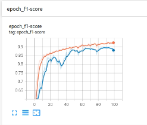
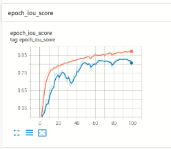
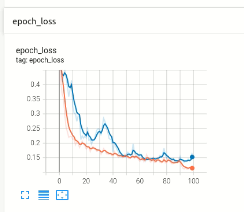

# wsi_tf_seg

### Environment:
- Cone this repo and checkout to **wsi_tf** branch
- Create Python 3.8.0 environment
  ```
  conda create --name wsi_tf_seg python=3.8.0
  conda activate wsi_tf_seg
  ```
- Install Dependencies
  ```
  pip install -r requirements.txt
  ```
- Create a workspace directory and change the config as per requirements.
- **NOTE**: You may need to downgrade "protobuf" as per tensorflow requirement. Check if tensorflow is able to access the GPU device:
  ```
  import tensorflow as tf
  print(tf.config.list_physical_devices('GPU'))
  ```

### Work directory Explaination, Also shared via google drive(without dataset):
- **Config/config.json**: Stores params, hyper-params and other configs for the whole pipeline. Update this file accordingly before running your experiment.
- **Logs**: This store log for experiment as well as tensorboard log for visualization.
- **Predictions**: This will store the prediction on valid images provided after model is trained by loading best weights.
- **Weights/Trained**: This will store both best and latest model weight file.

### Approach:
- In the previous approach, I used pytorch and I was focussed on making sure the model learns pixel perfect features. But after a lot of experiment and data analysis, I have observed that even annotations are not pixel perfect in the ground truth, so I pivoted my approach to very basic models like vanilla Unet and making sure the data is properly feed into the model.
- The decision to use tf in the second approach was basically to test whther I was doing anything wrong in terms of Data loaders in pytorch and whther models were learning proper features.
- In TF, I have mostly focussed on writing custom data loader and making sure other components of pipeline are also configurable.

### Steps:
- Create smaller patches with the same pre_process script.
  ```
  python pre_process.py
  ```
- In the workspace direcotry, Please check "Config/config.json" to update params and hyper-params as per need.
- Run main script to perform training, evaluation and inference. Change the working directory path in semantic.py as per your local path at line 35: *self.path = "/home/rnd/Documents/backup/DL/exp/unet_512"*
  ```
  python main.py
  ```
- After suceessful completion of above command, please use tensorboard to visualize the logs:
  ```
  cd unet_512
  tensorboard --logdir Logs/
  ```

### Results:
- Google Drive link for model weights, logs and Predictions: https://drive.google.com/drive/folders/1LBJBAHU-BHt6BxIspl_y8XTWxURw47Cp?usp=sharing
  
- Vanilla UNet and patch size = 512
    ```
    Test/Image/7105b8ee8d4c00c513b334fdfdcd6c49.png
    Dice coefficient for class Black: 0.9577465992110684
    Dice coefficient for class Yellow: 0.7000214177439925
    Dice coefficient for class Red: 0.7503046202049791
    Average Dice coefficient: 0.8026908790533467

    Test/Image/d0cf594c5106fb84e894c0b12013f367.png
    Dice coefficient for class Black: 0.9315076414180564
    Dice coefficient for class Yellow: 0.6543513431132717
    Dice coefficient for class Red: 0.8117898093166862
    Average Dice coefficient: 0.7992162646160047
    ```





### Disclaimer & References:
- I have used few open source codes and packages for the end-to-end implementation of this problem statement.
- [Link](https://github.com/bnsreenu/python_for_microscopists/blob/master/208-simple_multi_unet_model.py)

### Scope of Improvement:
- Following paper can be explored and other custom or open source models can be used for improved results.
- [Paperswithcode](https://paperswithcode.com/search?q_meta=&q_type=&q=Segment+Breast+Biopsy+Whole+Slide+Images)
- [Paper](https://arxiv.org/pdf/1709.02554v2.pdf)
- Other simple models can be used like LinkNet, SegNet or Hovernet.
- Specifically, I have seen a lot of people using Hovernet to develop models for WSI.
- Other simple approach can be to use multi scale resolution patch extraction and training vanilla UNET models.